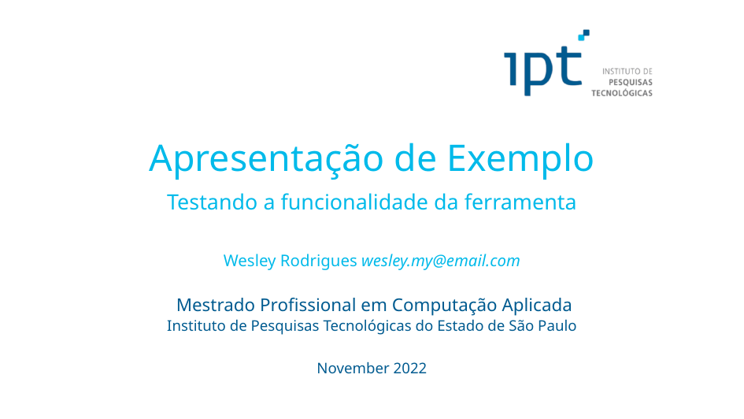
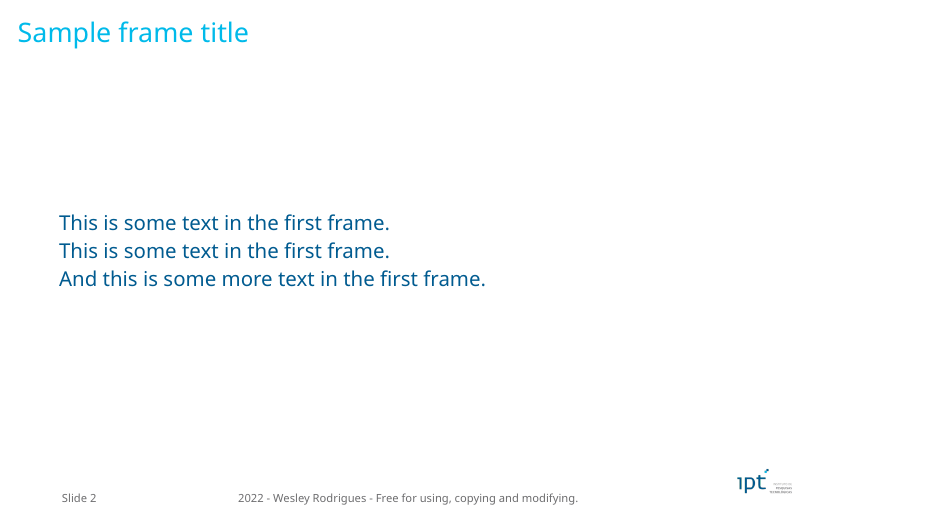

# Latex IPT Beamer

<!-- spell-checker: disable -->

Hi! This project contains a template for creating beamer presentations for the IPT (Instituto de Pesquisas Tecnológicas do Estado de São Paulo).
As a master's degree student, I use to write presentations with formulas and algorithms, and using LaTeX for this task is way easier than traditional presentation software.

## Slides Examples

## Usage

### Simplest way

Clone the repo and change the slides inside the `presentation.tex` file.

The customizations (like packages, preamble configurations, etc.) can be done inside the `wsconfig_beamer.tex`. 

### Cloning the GitHub repository

Install VSCode and the extension Latex Workshop. Then:

1. Clone the repo
2. Enter the directory
3. Rename the `presentation.tex` file to whatever you need
4. Open the directory in VSCode (`$ code .`)
5. Edit the text file while see the preview in VSCode
6. A lot of files will be created, you can run `make` to remove them

## Packages

This configuration includes some of the most used packages. This is the list:

- afterpage
- amsfonts
- amsmath
- amsthm
- array
- biblatex
- booktabs
- csquotes
- fancybox
- fancyhdr
- fetchcls
- fontenc
- geometry
- graphicx
- hyperref
- ifthen
- indentfirst
- inputenc
- lipsum
- listings
- lmodern
- microtype
- multirow
- nomencl
- pgfplots
- setspace
- siunitx
- tabularx
- tcolorbox
- tikz
- url
- xcolor

If you have any question, please, fill-up an issue at GitHub.
